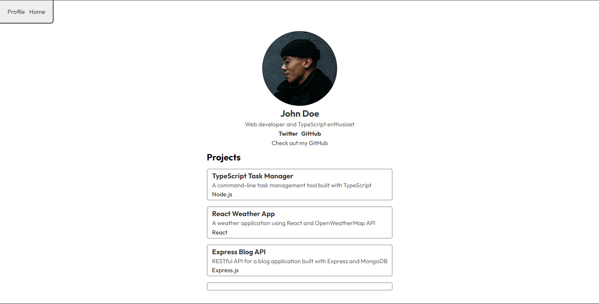

# JigSaw Templating Engine Documentation

JigSaw is a powerful, flexible templating engine for Node.js applications, written in TypeScript. It provides a straightforward approach to creating dynamic HTML content, complete with support for partials, control structures, and component-like rendering.

## Key Features

1. **File Structure:**

   - The new code separates the Knob class and JigSaw class into different files, improving modularity.

2. **Chokidar Integration:**

   - The new version uses the chokidar library for file watching, enabling hot reloading of templates and components.

3. **Build Process:**

   - Introduces a build process with a `.build` directory for storing generated HTML files.

4. **Dynamic Route Handling:**

   - Improved handling of dynamic routes with parameters (e.g., `/profile/:id`).

5. **Incremental Building:**

   - Adds an `incrementalBuild` method for updating specific routes when changes occur.

6. **Component System:**

   - Introduces a more robust component system with a dedicated `components` directory.

7. **Error Handling:**

   - More comprehensive error handling, especially for missing route parameters.

8. **Asynchronous Operations:**

   - Greater use of async/await for file operations and route handling.

9. **Configuration:**

   - Expanded configuration options, including the ability to set the server port.

10. **Template Loading:**

    - More flexible template loading, supporting both file paths and inline content.

11. **Development Mode:**

    - Introduces a development mode with hot reloading capabilities.

12. **Logging:**

    - More extensive logging for debugging and development purposes.

13. **Static File Serving:**

    - Improved handling of static files from a `public` directory.

14. **Component System:**

    - Components are defined in separate files with a `_` prefix and `.jig` extension in the `components` directory.

15. **Data Fetching:**

    - Supports asynchronous data fetching for dynamic content generation.

16. **Type Safety:**
    - Utilizes TypeScript for improved type safety and developer experience.

## Getting Started

### Prerequisites

- **Node.js** (version 12 or higher)
- **Git**

### Installation

To get started with JigSaw, first clone the repository to your local machine:

```bash
git clone https://github.com/Bethel-nz/jigsaw.git
cd jigsaw-templating-engine
```

Then, install the required dependencies:

```bash
bun i
```

### Usage

1. **Start the server**

   ```bash
   bun run dev
   ```

2. **Register a Template:**

   You can register templates either from a file or directly as a string:

   ```typescript
   // Using a file - it auto matically loads templates from the templates folder
   JigSaw.registerTemplate(['index', 'profile']);
   ```

3. **Register a Route:**

   Routes are registered with a path and a handler function:

   ```typescript
   JigSaw.registerRoute('/profile', async (params) => {
     const data = {
       name: 'John Doe',
       bio: 'Web developer',
       profileImage: {
         tag: 'img',
         props: {
           src: '/images/john-doe.jpg',
           alt: 'John Doe',
         },
       },
     };
     return JigSaw.render('profile', data);
   });

   -- OR --

   //you can also use dynamic routes
    JigSaw.registerRoute('/profile/:id', async (params) => {
    const data = await fetchUserData(params!.id);
      return JigSaw.render('profile', data);
      });
   ```

4. **Set your port:**

To set up your port and start the server, simply call:

```typescript
JigSaw.configure({
  port: 8750, // <- you can set your port here
});

JigSaw.serve();
```

## Template Syntax

JigSaw's template syntax is designed to be intuitive and flexible:

- **Variable Interpolation:** `{{ variableName }}`
- **Components:** `{{{ componentName }}}`
- **Control Structures:**
  - **If/Else:** ` ...  ... `
  - **For Loops:** ` ... `

### Example Template

Here's a simple example to illustrate the syntax:

```html
<div class="profile">
  {{ profileImage }}
  <h1>{{ name }}</h1>
  
  <p>{{ bio }}</p>
  
</div>
```

## Component

```html

```

To use a component in a template:

```html
{{{ profileImage }}}
```

## Advanced Features

### Component-like Rendering

JigSaw supports rendering component-like structures, which can be used to build complex UI elements:

```typescript
const data = {
  socialLinks: {
    tag: 'div',
    props: { class: 'social-links' },
    children: [
      {
        tag: 'a',
        props: { href: 'https://twitter.com/johndoe' },
        content: 'Twitter',
      },
      {
        tag: 'a',
        props: { href: 'https://github.com/johndoe' },
        content: 'GitHub',
      },
    ],
  },
};
```

### Special Types

JigSaw includes special types for links and headers:

```typescript
const data = {
  githubLink: {
    type: 'link',
    href: 'https://github.com/johndoe',
    text: 'Check out my GitHub',
    title: "John Doe's GitHub Profile",
  },
  headerName: {
    type: 'header',
    level: 1,
    text: 'John Doe',
    id: 'profile-name',
  },
};
```

### Typescript

JigSaw is written in TypeScript, so it provides type safety and autocomplete for your templates.

```typescript
interface UserData {
  userData: {
    name: string;
  };
  bio: string;
  profileImage: {
    src: string;
    alt: string;
    class: string;
  };
  // ... other properties
}
export async function fetchUserData(userId: string): Promise<UserData> {
  // ... implementation
}
```

### File Structure

- `templates/`: Contains main template files (e.g., `profile.jig`)
- `components/`: Contains reusable component files (e.g., `_profileImage.jig`)
- `public/`: Static assets served directly by the server
- `.build/`: Generated HTML files for each route

### Development Mode

JigSaw includes a development mode with hot reloading:

```typescript
this.startWatcher() <- private module
```

This watches for changes in templates and components, automatically rebuilding affected routes.

### Static File Serving

JigSaw automatically serves static files from the `static` directory located in the project root. Simply place your static assets (e.g., CSS, JavaScript, images) in this directory, and they will be accessible via the server.

## API Reference

For detailed information on JigSaw's API, refer to the source code in the `src` directory.

## Examples

Check out the `//#examples` section in src code for sample projects that demonstrate JigSaw's capabilities.

- 

## Performance Considerations

While JigSaw is powerful for learning and small projects, for production use consider:

1. Implementing caching mechanisms for rendered templates
2. Optimizing the template parsing and rendering process
3. Implementing proper error handling and logging
4. Ensuring secure handling of user input to prevent XSS attacks

## Final Note

This implementation of JigSaw is a powerful tool for learning and building templating engines. However, for production use, more extensive testing, error handling, and performance optimizations are recommended. Additionally, security considerations, such as input sanitization, should be taken into account to prevent vulnerabilities in real-world applications.
