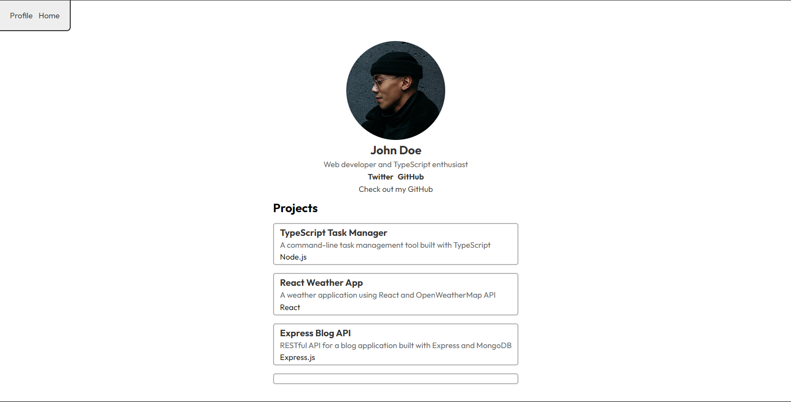

# Jigsaw Template Engine

Jigsaw is a **modern, lightweight template engine for Node.js/Bun applications** written in TypeScript. It's designed for learning purposes and features an innovative Islands Architecture combined with View Transitions for building dynamic, SPA-like experiences with multi-page architecture.

**Key Philosophy**: Provides the interactivity of SPAs (Single Page Applications) while maintaining the simplicity of multi-page applications through Islands Architecture and smart client-side routing.



## Core Features

- **Islands Architecture**: Persistent UI components that survive navigation, ideal for navigation bars, audio players, and shopping carts.
- **View Transitions API**: Native browser animations for smooth page transitions without extra JavaScript libraries.
- **Modern Template Syntax**: Includes variable interpolation, control structures, components, and more.
- **Reactivity**: Built-in support for reactive state management.
- **Dynamic Routing**: Pattern-based routing for creating dynamic pages and APIs.
- **Hot Module Replacement (HMR)**: Automatic reloading of templates and live updates for CSS.
- **Performance-focused**: Features persistent and in-memory caching, streaming, and background cache warming.
- **Static Site Generation (SSG)**: Build your dynamic application into a static site with a single command.

## Getting Started

### Prerequisites

- Node.js (version 12 or higher)
- Bun (for package management and running the project) but any package manager will work

### Installation

```bash
git clone https://github.com/Bethel-nz/jigsaw.git
cd jigsaw
bun i
```

### Basic Usage

1. **Start the server**

   ```bash
   bun run dev
   ```

2. **Register Templates and Routes**

   ```typescript
   // Register templates
   JigSaw.template(['index', 'profile']);

   // Register a route
   JigSaw.route('/profile/:id', async (params) => {
     const data = await fetchUserData(params!.id);
     return JigSaw.render('profile', data);
   });

   // Configure and start the server
   JigSaw.serve({ port: 8750 });
   ```

## Documentation

For more detailed information, please refer to the documentation in the `docs` folder:

- **[TUTORIAL.md](./docs/TUTORIAL.md)**: A step-by-step guide to building your first Jigsaw application.
- **[SYNTAX.md](./docs/SYNTAX.md)**: A comprehensive guide to the Jigsaw template syntax.
- **[API.md](./docs/API.md)**: The complete API reference for the Jigsaw template engine.
- **[SECURITY.md](./docs/SECURITY.md)**: Best practices for building secure applications with Jigsaw.

## Note

This implementation of JigSaw is primarily for learning purposes. For production use, additional testing, error handling, and optimizations are recommended.